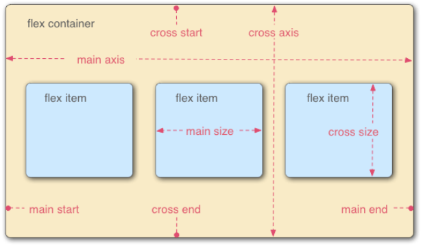
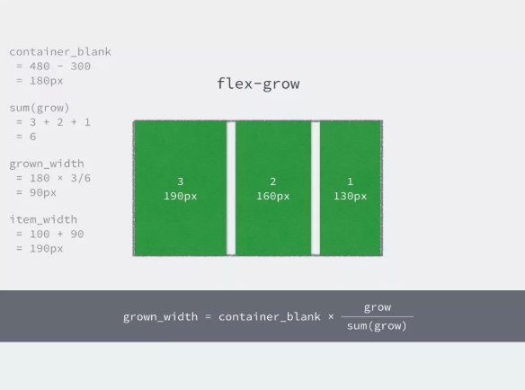

### Flex的基本概念

### 使用方法  
父容器：  
1. display:flex | inline-flex;适用父元素  
2. flex-direction: row|row-reverse|column|column-reverse  
3. flex-wrap:nowrap|wrap|wrap-reverse定义伸缩容器里是单行还是多行  
4. flex-flow：'flex-direction'||'flex-wrap'前两项的缩写  
5. justify-content:flex-start|flex-end|center|space-between  space-around用来定义伸缩项目沿主线的对齐方式  
6. align-items:flex-start|flex-end|center|baseline||stretch  
7. align-content:flex-start|flex-end|center|space-between|space-around  stretch伸缩行在伸缩容器的对其方式    

子项目属性：  
1. order:数值越小，排列越靠前  
2. flex-grow：增大系数  
3. flex-shrink:缩小系数  
4. flex-basis:length|auto  
5. flex：none|'flex-grow''flex-shrink''flex-basis'缩写  
6. align-self:flex-start|flex-end|center|baseline|stretch单个项目与主轴不一样的对其方式  

原理：  
flex-grow如何计算的  
  

### 参考：
https://www.cnblogs.com/imwtr/p/4767664.html  
Flex 布局教程：实例篇 http://www.ruanyifeng.com/blog/2015/07/flex-examples.html