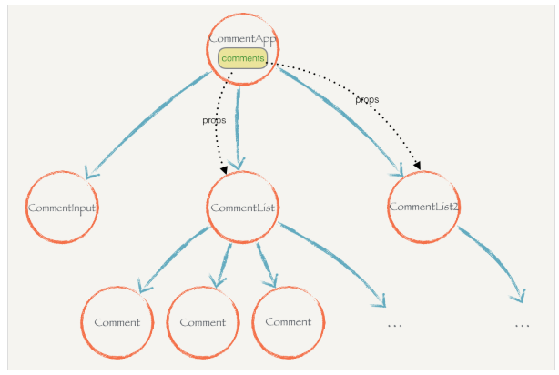

## 什么是状态提升？  
把组件之间的共享状态交给组件最近的公共父节点保管。

## 挂载阶段的组件生命周期？
1. 组件挂载开始之前componentWillMount
2. 组件挂载完成之后componentDidMount
3. 组件对应的DOM元素从页面删除之前调用componentWillUnmount
4. shouldComponentUpdate(nextProps,nextState)控制组件是否重新渲染，返回false不会重新渲染
5. componentWillReceiveProps(nextProps)组件从父组件接收到新的props之前调用
6. componentWillUpdate()组件开始重新渲染之前调用
7. componentDidUpdate()组件重新渲染并且把更改变更到真实DOM以后调用